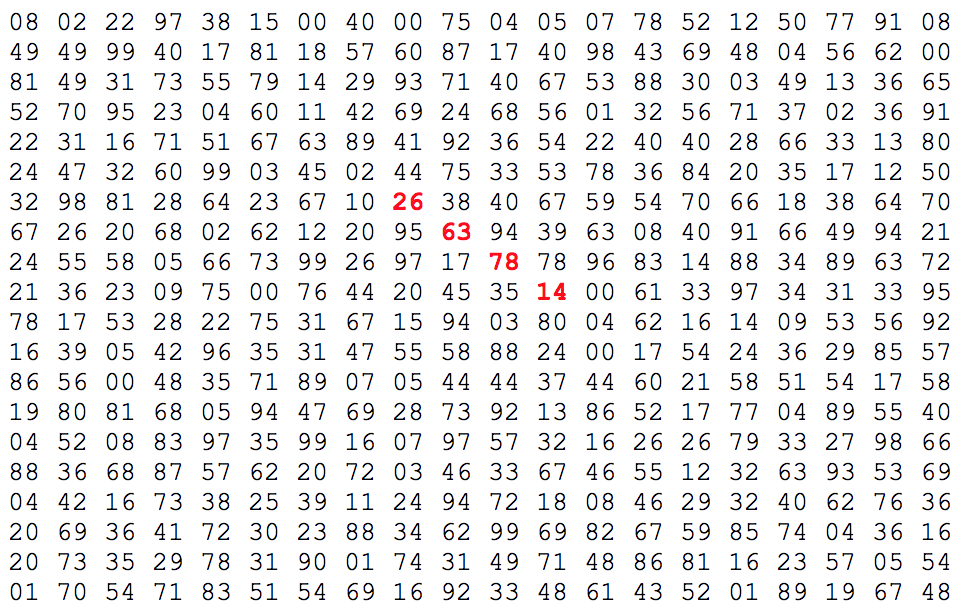

# Largest product in a grid

## [Problem Description](https://projecteuler.net/problem=11)

In the 20×20 grid below, four numbers along a diagonal line have been marked in red.



The product of these numbers is 26 × 63 × 78 × 14 = 1788696.

What is the greatest product of four adjacent numbers in the same direction (up, down, left, right, or diagonally) in the 20×20 grid?

## Performance

[Try it online!](https://tio.run/##xVddb9NYEH3vr/AKqUogpL7f96LVihceeGLfEapCY4pFYkeOU6WI/17m3BkXm7a7qIBAsuL7MTNnzpwZl2pTH@vu5ubJX2eHfXf2vm7OquaqqPL2ybr6sG3Xh01V/Nu17zfVtlSqWLcnJ0Xxcrvqu/pYvC3joij1otD0pLAoDK2Vo71yUdiSfwPWlh780p1AdxzdV/Q4nNNeUnQWF@T69p9Ni/ykxK4UXYt0TcGc3j3txcD7OE@0bw3t437kkM7TWmcYY9dwA9eGfgOZOEIWaK3IRCMk7QXFbj25d7SO5NIgI8O2in4N3LuJayQWgIZcasMogFTBnWZ0GnuR0ZW0bzS/I6QJTChcEylj1@AYiJVcdYrReaBD0rROYuos18RKHTSF87RvDCOPU0KAyAZGArTgPCfqGI21XEaYgwyUEGEiwtB947gOUtKxa7hEacB5RmGZGCBXQOZZNbdcJ0YPEoEY5TZiF6aucR3mQOBFiF6EpaUGICeRqUn8XkooCA7us8IASd0hBKpwkXWLq1AKiEHIJMIDEXgSyDCsoKwUyzVByKCnrhVzl9WRpD3QBp55BnLwnjm1fOYVc59bzLIM8noqPiBRoldwDQXksolS0JlItmQFsDg1KyqHSmwLMaYpalwBhyADOkbCRlxDOQNZSF4L6gzF8jpnTPbR5e6ddKOXVii5ceEW@gZ/mBc5pOUH7WGlpUAkQqIPECaHm84QlThRiM9LKZNoPXdilLJqaQsvoynwWCqljMjOTsWXx4tmQcWhNI4VArKAHHtO2gp7Wh7MGpRPB@4NUteEEOkuII7iwoumg5bOlGZGWfEOhNB97mDDI8zxNPwetRU0SBydpR2XFiMKpQJBCIPOy@0ipTMyTwAFYjVT1LkLEyPHKIILDExtvrUETEEQ7kX9reGhimCZb9iru64zWsdI8vjBtCt5gAZpCTRzntuRSxllWgKCEyWRUiaEKB41eeQoLuUgKC@lzEPVsFt0Ir4yufQiUqgs1yG@w8eRvpu7YtfRp/Oin23qfT/HVxPBXjWH7bKr6KDKB4vi9OmZntNZ1axvTS@rpupWfXX@se3qz23Trzbnl1172NXN5X7q8EPbFdfF38@LcrlUo0ofh70Rj@v2xShxuBktv/zD4NZdu5sdn10/1eX8nuN@9ama2QcBX1VdX1/8IFx/D9z06@GeV4TqevaofNb16rJtfiIf//vyUY/IZ9X09Z/Jycx/KluVHpHtAwm@/YH@GlL8X2XfufgQvXcu/lct3p2M07xom4tVP8my2Lebq2rISP4aH4zuIWA@cbhd7Wanw4A6VfPvT4@zgdMc8fWb5e7Q70f/C1jm8Dc3XwE)

```
Real time: 0.778 s
User time: 0.366 s
Sys. time: 0.284 s
CPU share: 83.68 %
Exit code: 0
```